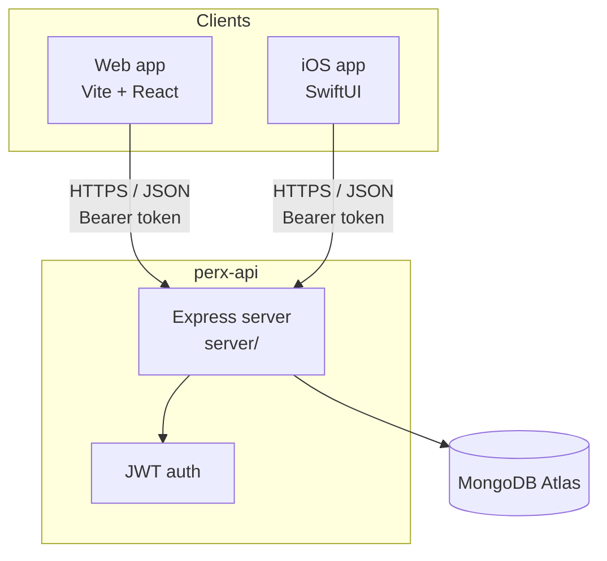

# PERX

PERX is a benefits marketplace for companies and employees — browse local partners, spend a company-funded budget, play engagement games, and redeem benefits with QR codes. The product ships as a **React web app**, a **native iOS app**, and a shared **Express API** backed by **MongoDB Atlas**.

Built for JunctionX Tirana 2026 (TeamSystem challenge).

---

## Architecture

Both clients talk to the same REST API. The API is the only component that reads or writes MongoDB. State changes made on web or iOS are visible to the other client after the next fetch (the web app also polls every 8 seconds while the tab is focused).



### Shared auth model

| Item | Web | iOS | Server |
|------|-----|-----|--------|
| Login | `POST /auth/login` | `API.login()` | bcrypt + JWT |
| Token storage | `localStorage` key `perx.token` | `UserDefaults` key `perx.token` | — |
| Authenticated requests | `Authorization: Bearer <token>` | same | `requireAuth` middleware |
| Session restore | `bootstrapSession()` on load | `SessionStore.restore()` | `GET /auth/me` |

The JWT payload contains `sub` (user id), `role`, and `email`, signed with `JWT_SECRET` (30-day expiry).

---

## Repository layout

```
perx/
├── src/                    # React web app (Vite)
│   ├── pages/              # Routes: marketing, login, employee, admin
│   ├── components/         # UI, 3D hero, benefit cards, games
│   ├── lib/                # store.js (client state), api.js, i18n
│   └── i18n/               # English + Albanian (sq)
├── server/                 # Express API + Mongoose models
│   └── src/
│       ├── routes/         # auth, employees, admin, providers, requests
│       ├── models/         # User, Employee, Provider, Request, Redemption
│       ├── lib/            # db, auth, discountCodes
│       └── seed.js         # Demo users + provider catalog
├── ios/                    # Native SwiftUI app
│   └── Perx/
│       ├── Perx.xcodeproj  # Open this in Xcode
│       ├── project.yml     # XcodeGen spec (optional regen)
│       └── Perx/           # Swift sources
├── public/                 # Static assets (logo, favicon, videos)
├── vercel.json             # Vercel SPA build + rewrites
└── dist/                   # Production web build output (generated)
```

---

## Prerequisites

| Tool | Version | Used for |
|------|---------|----------|
| Node.js | 20+ | Web app + API (Vercel uses Node 20) |
| npm | 9+ | Package management |
| MongoDB Atlas | — | Cloud database ([free tier](https://www.mongodb.com/atlas) works) |
| Xcode | 15+ | iOS app (macOS only) |
| XcodeGen | optional | Regenerate `Perx.xcodeproj` from `project.yml` |

---

## Quick start (full stack)

### 1. MongoDB Atlas

1. Create a cluster at [mongodb.com/atlas](https://www.mongodb.com/atlas).
2. Add a database user and allow your IP (or `0.0.0.0/0` for dev).
3. Copy the connection string (`mongodb+srv://…`).

### 2. API server

```bash
cd server
npm install
cp .env.example .env
```

Edit `server/.env`:

```env
PORT=4000
DATABASE_URL=mongodb+srv://<user>:<pass>@<cluster>.mongodb.net/perx?retryWrites=true&w=majority
JWT_SECRET=your-long-random-secret
CORS_ORIGIN=*
```

Seed demo data and start the API:

```bash
npm run seed    # demo users + 12 providers
npm run dev     # http://localhost:4000
```

Health check: `GET http://localhost:4000/health` → `{ "ok": true, "service": "perx-api" }`

### 3. Web app

From the repo root:

```bash
npm install
cp .env.example .env
npm run dev     # http://localhost:5173
```

Optional root `.env`:

```env
VITE_API_URL=http://localhost:4000
```

Production build:

```bash
npm run build
npm run preview
```

---

## Deploy to Vercel (web + API)

Vercel serves **both** the Vite frontend and the Express API on the same domain. API routes (`/auth`, `/employees`, …) are rewritten to a serverless function in `api/index.js` — no separate backend host required.

### 1. Connect the repo

Import the GitHub repo in Vercel. `vercel.json` handles the Vite build and API rewrites.

### 2. Environment variables (Vercel → Settings → Environment Variables)

| Variable | Required | Description |
|----------|----------|-------------|
| `DATABASE_URL` | **yes** | MongoDB Atlas connection string |
| `JWT_SECRET` | **yes** | Long random string for signing JWTs |
| `CORS_ORIGIN` | no | Defaults to `*` (same-origin works without changing this) |

You do **not** need `VITE_API_URL` on Vercel — production calls the API on the same domain.

Apply to **Production**, **Preview**, and **Development**, then redeploy.

### 3. Seed the production database (required for demo login)

Atlas IP whitelist (`0.0.0.0/0`) only allows connections — it does **not** create users. Run seed **once** from your machine against the same cluster:

```bash
cd server
DATABASE_URL="mongodb+srv://<user>:<pass>@<cluster>.mongodb.net/perx?..." \
JWT_SECRET="same-secret-as-vercel" \
npm run seed
```

Demo accounts after seed: `arta.koci@perx.al` / `perx123`, `admin@perx.al` / `admin2026`.

### 4. Verify deployment

```bash
curl https://your-app.vercel.app/health
# → {"ok":true,"service":"perx-api","db":"configured"}

curl -X POST https://your-app.vercel.app/auth/login \
  -H 'Content-Type: application/json' \
  -d '{"email":"arta.koci@perx.al","password":"perx123"}'
# → {"token":"...","user":{...}}
```

### Troubleshooting

| Issue | Fix |
|-------|-----|
| Login fails instantly | Check `/health` — if `db: "missing"`, add `DATABASE_URL` on Vercel and redeploy |
| `invalid_credentials` | Run `npm run seed` against prod `DATABASE_URL` |
| `ERESOLVE` on install | Use `@vitejs/plugin-react@^6` with Vite 8 |
| API 404 on Vercel | Ensure latest code with `api/index.js` + rewrites is deployed |
| Works locally, not prod | Old builds pointed at `localhost:4000` — pull latest (same-origin API) |

---

### 4. iOS app

Start the API first (step 2), then:

```bash
open ios/Perx/Perx.xcodeproj
```

In Xcode: select an **iPhone simulator** → **Run** (⌘R).

**Simulator:** `Config.swift` defaults to `http://localhost:4000` — works out of the box.

**Physical device:** edit `ios/Perx/Perx/Config.swift` and set `apiBaseURL` to your Mac's LAN IP:

```swift
static let apiBaseURL = URL(string: "http://192.168.1.10:4000")!
```

Ensure the device and Mac are on the same network and Atlas/network firewall allows connections.

#### Regenerating the Xcode project (optional)

The committed `.xcodeproj` works as-is. To regenerate from `project.yml`:

```bash
brew install xcodegen
cd ios/Perx && xcodegen generate
```

| Setting | Value |
|---------|-------|
| Bundle ID | `al.perx.app` |
| Min iOS | 16.0 |
| Swift | 5.9 |
| UI | SwiftUI |

---

## Demo accounts

Created by `npm run seed` in `server/`:

| Role | Email | Password |
|------|-------|----------|
| Employee | `arta.koci@perx.al` | `perx123` |
| Employee | `blend.hoxha@perx.al` | `perx123` |
| Admin | `admin@perx.al` | `admin2026` |

---

## MongoDB collections

| Collection | Model | Purpose |
|------------|-------|---------|
| `users` | `User` | Accounts — email, role (`employee` \| `admin`), budget, department |
| `employees` | `Employee` | Per-user state — cart, active benefits, games, discount codes, preferences |
| `providers` | `Provider` | Benefit catalog — slug, category, cost, media URLs |
| `requests` | `Request` | Benefit approval workflow — pending / approved / rejected |
| `redemptions` | `Redemption` | QR redemption audit trail (single-use `jti`) |

### How data flows between clients

1. **Login** — both clients call `POST /auth/login`, receive `{ token, user }`, persist the JWT.
2. **Hydration** — web: `bootstrapSession()` → `GET /auth/me` + employee/admin endpoints; iOS: `SessionStore.restore()` → same calls.
3. **Mutations** — cart changes, requests, game rewards, QR generation go through the API and update MongoDB.
4. **Sync** — web polls every 8s on focus; iOS refreshes on navigation/actions. No WebSockets — last write wins via API.

Example: an employee adds a benefit to their cart on **web** → `POST /employees/me/cart` updates `employees.cart` in MongoDB → **iOS** sees it on next `refreshEmployee()`.

---

## Web app

**Stack:** React 18, Vite, React Router, Tailwind CSS, Framer Motion, Three.js (hero), i18next (EN/SQ).

### Routes

| Path | Access | Description |
|------|--------|-------------|
| `/` | Public | Landing page + 3D hero |
| `/features`, `/about`, `/contact`, … | Public | Marketing pages |
| `/login` | Public | Demo account picker (no manual email form) |
| `/employee/*` | Employee JWT | Dashboard, benefits, Perky AI, games, card, budget |
| `/admin/*` | Admin JWT | Employees, statistics, deals, QR validate, settings |

### Client state (`src/lib/store.js`)

The web app keeps a reactive in-memory store that mirrors API data:

- JWT in `localStorage` (`perx.token`)
- On reload, `sessionLoading` gates protected routes until `GET /auth/me` completes
- Mutations (cart, requests, games) optimistically update local state, then reconcile with API responses

### Key features

- Curated benefit marketplace with video/poster media
- Perky AI concierge (client-side assistant in `src/lib/perky.js`)
- Mini-games (scratch, spin) with discount-code rewards
- Membership card + single-use benefit QR codes
- Admin QR scanner for in-store validation (`html5-qrcode`)
- Mobile-first employee panel with sticky sidebar (desktop) and 5-tab bottom nav + **More** sheet (mobile)
- Light/dark theme, Albanian + English
- Official PerX logo (`public/perx-logo.png`) site-wide

---

## iOS app

**Stack:** SwiftUI, async/await, `URLSession`, shared JWT with web.

### App structure

| File | Role |
|------|------|
| `PerxApp.swift` | App entry, theme, routes to login / employee / admin |
| `SessionStore.swift` | Observable session — mirrors web `store.js` |
| `API.swift` | REST client, token in `UserDefaults` |
| `Config.swift` | API base URL |
| `EmployeeTabView.swift` | Home, Benefits, Perky, Games, Profile |
| `AdminTabView.swift` | Overview, Requests, Validate (QR), Profile |
| `MemberCardView.swift` | Digital membership card + benefit QR |
| `ValidateCardView.swift` | Admin QR lookup + redeem |

### Employee tabs

- **Home** — budget summary, cart, quick actions
- **Benefits** — provider catalog (same data as web)
- **Perky** — AI concierge
- **Games** — engagement mini-games
- **Profile** — account + sign out

### Admin tabs

- **Overview** — KPIs, recent requests
- **Requests** — approve / reject benefit requests
- **Validate** — scan employee QR codes, redeem benefits
- **Profile** — sign out

On launch, `RootView` calls `session.restore()` — if a saved token exists, it fetches `/auth/me` and loads employee/admin data without showing login again.

---

## API reference

Base URL: `http://localhost:4000` (configurable).

### Auth

```
POST   /auth/login       { email, password } → { token, user }
POST   /auth/register    { email, password, name, role? }
GET    /auth/me          Bearer → { user }
```

### Providers (public)

```
GET    /providers              ?category=food
GET    /providers/:slug
```

### Employee (Bearer, role: employee)

```
GET    /employees/me
PATCH  /employees/me           { cart?, activeBenefits?, preferences?, games?, … }
POST   /employees/me/cart      { slug }
DELETE /employees/me/cart/:slug
GET    /employees/me/card      membership card payload
POST   /employees/me/card/qr   { providerSlug } → short-lived QR token
POST   /employees/me/games/reward
PATCH  /employees/me/discount-codes/:id/use
```

### Requests (Bearer)

```
GET    /requests                 admin: all; employee: own
POST   /requests                 { items: [slug] }
POST   /requests/:id/decide      admin — { decision: "approved"|"rejected" }
```

### Admin (Bearer, role: admin)

```
GET    /admin/overview           users + employees summary
POST   /admin/card/lookup        { token } — preview QR scan
POST   /admin/card/redeem        { token, providerSlug } — single-use redeem
```

See [`server/README.md`](server/README.md) for a compact route list.

---

## Membership card & QR redemption

1. Employee opens **Card** (web `/employee/card` or iOS `MemberCardView`).
2. Selects an active benefit → `POST /employees/me/card/qr` returns a **3-minute**, single-use JWT (`typ: "card"`, unique `jti`).
3. Admin scans the QR → `POST /admin/card/lookup` then `POST /admin/card/redeem`.
4. Redemption is recorded in `redemptions`; the `jti` cannot be reused.

---

## Environment variables

### Web (`.env`)

| Variable | Default | Description |
|----------|---------|-------------|
| `VITE_API_URL` | `http://localhost:4000` | API base URL (required in production on Vercel) |

### Server (`server/.env`)

| Variable | Required | Description |
|----------|----------|-------------|
| `DATABASE_URL` | yes | MongoDB Atlas connection string |
| `JWT_SECRET` | yes | Secret for signing JWTs |
| `PORT` | no | API port (default `4000`) |
| `CORS_ORIGIN` | no | CORS origin (default `*`) |

### iOS (`Config.swift`)

| Setting | Default | Description |
|---------|---------|-------------|
| `apiBaseURL` | `http://localhost:4000` | Must match running API |

---

## Development tips

### Run everything locally

```bash
# Terminal 1 — API
cd server && npm run dev

# Terminal 2 — Web
npm run dev

# Terminal 3 — iOS (optional)
open ios/Perx/Perx.xcodeproj
```

### Reset database

```bash
cd server && npm run seed
```

Re-running seed upserts demo users and replaces the provider catalog.

### Web ↔ iOS parity checklist

When adding a feature, typically touch:

1. `server/src/routes/` + model (if new data)
2. `src/lib/api.js` + `src/lib/store.js` (web)
3. `ios/Perx/Perx/API.swift` + `SessionStore.swift` (iOS)
4. UI on both platforms

### CORS and mobile

The API uses `cors` with `CORS_ORIGIN=*` by default. For production, set a specific origin. iOS native requests are not browser CORS-limited, but still need network reachability to the API host.

---

## Scripts

| Location | Command | Description |
|----------|---------|-------------|
| Root | `npm run dev` | Vite dev server |
| Root | `npm run build` | Production web build → `dist/` |
| Root | `npm run preview` | Preview production build |
| Root | `npx vercel` | Deploy web app to Vercel (preview) |
| Root | `npx vercel --prod` | Deploy web app to production |
| `server/` | `npm run dev` | API with `--watch` |
| `server/` | `npm run seed` | Seed MongoDB |
| `server/` | `npm start` | Production API (no watch) |

---

## Further reading

- [`server/README.md`](server/README.md) — API quick start
- [`ios/README.md`](ios/README.md) — iOS-specific notes
- [`DESIGN.md`](DESIGN.md) — design system tokens and patterns

---

## License

Private / hackathon project — TeamSystem JunctionX Tirana 2026.
